# 📊 APS Failure Prediction with Tree-Based Models

## 📌 Overview

This project focuses on solving a **binary classification problem on an
imbalanced dataset**, using the APS Failure dataset.

The study explores: - Tree-based machine learning models
- The impact of **class imbalance**
- Techniques for improving minority class detection

This project emphasizes **practical implementation and performance
analysis**, rather than theoretical derivation.

------------------------------------------------------------------------

## 📖 Problem Description

The goal is to predict whether a system will fail based on sensor
measurements.

### 🔹 Key Challenges

-   Highly **imbalanced dataset**
-   Large number of missing values
-   Difficulty detecting rare failure events

------------------------------------------------------------------------

## 🧠 Methodology

### 🔹 Data Preprocessing

-   Missing value imputation (Median)
-   Missing indicator variables
-   Feature variability analysis (Coefficient of Variation)
-   Correlation analysis
-   Data visualization

#### 📌 Purpose

-   Improve data quality
-   Understand feature behavior

------------------------------------------------------------------------

### 🔹 Model 1: Random Forest (Baseline)

- Trained on the original dataset
- Ensemble of decision trees

#### 📊 Evaluation

- Training error
- Test error
- OOB (Out-of-Bag) error: 0.00608

#### 📈 Observations

- The OOB error is close to the test error, suggesting good generalization ability.
- Although the training error is very low, this does not necessarily indicate severe overfitting, since Random Forest can fit the training data well through an ensemble of deep decision trees.
- The baseline model achieves strong overall performance:
  - Accuracy: 0.993
  - Precision: 0.949
  - Recall: 0.736
  - F1-score: 0.829
- However, the recall is still limited, showing that some minority-class failure cases are missed.

#### ⚠️ Limitation

- Biased toward the majority class
- Minority-class recall can still be improved

------------------------------------------------------------------------

### 🔹 Class Imbalance Handling

#### ⚠️ Problem

- Failure cases are rare
- Models may ignore the minority class

#### ✅ Solutions

- **Class Weight Balanced**
- **SMOTE (Synthetic Minority Over-sampling Technique)**

#### 📈 Effect

- Class Weight adjusts the penalty for misclassifying the minority class.
- SMOTE creates synthetic minority samples and changes the training distribution.
- These methods aim to improve minority-class detection, but their effects are different.

------------------------------------------------------------------------

### 🔹 Model 2: Random Forest + Class Weight Balanced

- Trained with `class_weight='balanced'`

#### 📊 Observations

- Accuracy: 0.989
- Precision: 0.940
- Recall: 0.573
- F1-score: 0.712

#### 📈 Interpretation

- Class weighting does not improve minority-class detection in this dataset.
- Recall decreases compared to the baseline Random Forest.
- The model becomes less effective at identifying failure cases.
- This suggests that class weighting alone is not sufficient for this problem.

------------------------------------------------------------------------

### 🔹 Model 3: Random Forest + SMOTE

- Trained on a SMOTE-rebalanced dataset

#### 📊 Observations

- Accuracy: 0.992
- Precision: 0.789
- Recall: 0.837
- F1-score: 0.812

#### 📈 Interpretation

- SMOTE significantly improves recall, meaning the model detects more failure cases.
- The number of false positives increases, which lowers precision.
- Compared with the baseline model, this approach provides a better balance for minority-class detection.
- Among the Random Forest variants, SMOTE gives the best recall performance.

------------------------------------------------------------------------

### 🔹 Model 4: XGBoost (Baseline)

- Gradient boosting model

#### 📊 Characteristics

- Strong predictive performance
- Sensitive to hyperparameters

#### 📊 Observations

- Accuracy: 0.991
- Precision: 0.904
- Recall: 0.704
- F1-score: 0.791

#### 📈 Interpretation

- XGBoost performs competitively, but it does not outperform the baseline Random Forest.
- Its recall is slightly lower than Random Forest, indicating weaker minority-class detection.
- Overall, it is a strong model, but not the best choice for this task without imbalance handling.

------------------------------------------------------------------------

### 🔹 Model 5: XGBoost + SMOTE

- Gradient boosting model combined with SMOTE for class balancing

#### 📊 Characteristics

- Captures complex nonlinear relationships
- Sensitive to hyperparameters and data distribution

#### 📊 Observations

- Accuracy: 0.980
- Precision: 0.546
- Recall: 0.925
- F1-score: 0.686

#### 📈 Interpretation

- This model achieves the highest recall, meaning it detects the most failure cases.
- However, precision drops substantially because of many false positives.
- The model is useful when missing a failure is more costly than raising a false alarm.
- In terms of balanced performance, it is less stable than Random Forest + SMOTE.

------------------------------------------------------------------------

## ⚙️ Features

### 🔹 Model Capability

-   Handles **imbalanced classification problems**

### 🔹 Models Used

-   Random Forest
-   XGBoost

### 🔹 Evaluation Metrics

-   Accuracy
-   Precision
-   Recall
-   F1-score
-   AUC

------------------------------------------------------------------------

## 📂 Dataset

### 🔹 APS Failure Dataset

-   Industrial sensor data

#### 📊 Label Definition

-   `0` → Normal
-   `1` → Failure

#### 📌 Characteristics

-   Highly imbalanced
-   Contains many missing values

------------------------------------------------------------------------

## 📈 Results

### 🔹 Random Forest (Baseline)

-   High accuracy
-   Poor minority class detection

------------------------------------------------------------------------

### 🔹 Random Forest + SMOTE

-   Significant improvement in Recall
-   Better detection of failure cases
-   Increase in false positives
-   AUC remains similar

------------------------------------------------------------------------

### 🔹 Model Comparison

| Model               | Accuracy | Precision | Recall | F1-score | AUC |
|--------------------|----------|----------|--------|----------|-----|
| Random Forest       | **0.993**| **0.949**| 0.736  | **0.829**| 0.993 |
| RF + Class Weight   | 0.989    | 0.940    | 0.573  | 0.712    | 0.992  |
| RF + SMOTE          | 0.992    | 0.789    | **0.837** | 0.812  | 0.993  |
| XGBoost             | 0.991    | 0.904    | 0.704  | 0.791    | 0.996  |
| XGBoost + SMOTE     | 0.980    | 0.546    | **0.925** | 0.686  |  0.994 |

#### 📌 Insight
Random Forest achieves the best overall performance, while SMOTE significantly improves recall. Among all methods, Random Forest with SMOTE provides the best balance between precision and recall.


------------------------------------------------------------------------

## 📊 Visualization

### 🔹 Correlation Matrix


#### 📌 Insight

-   Some features are highly correlated
-   Tree models are less affected by multicollinearity

------------------------------------------------------------------------

### 🔹 Feature distribution / Feature vs class analysis

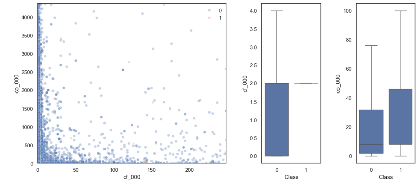

#### 📌 Insight

-   Severe class imbalance
-   Resampling is necessary

------------------------------------------------------------------------

### 🔹 Confusion Matrix (Before SMOTE)

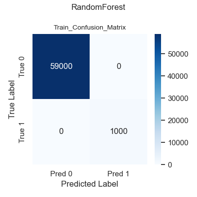

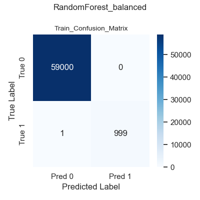
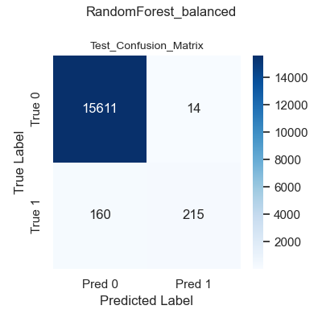
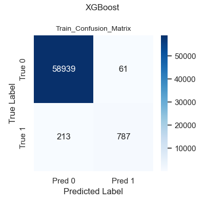


------------------------------------------------------------------------

### 🔹 Confusion Matrix (After SMOTE)


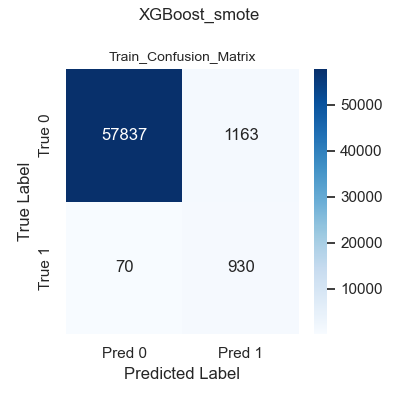


#### 📌 Insight

-   Improved detection of failure cases

------------------------------------------------------------------------

### 🔹 ROC Curve Comparison

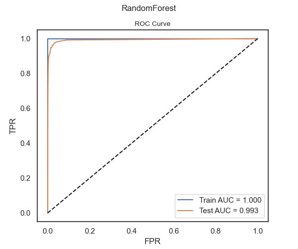
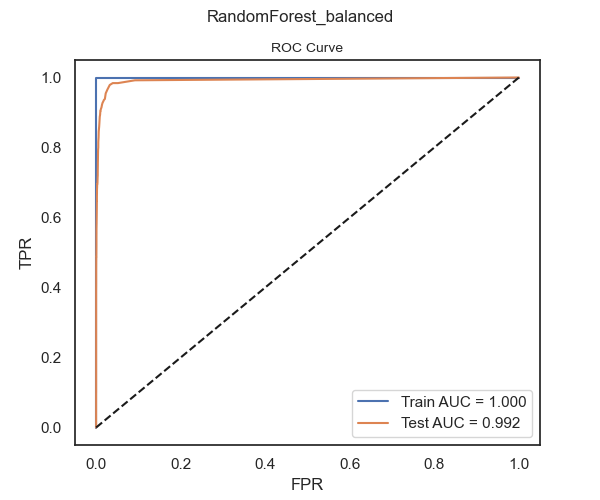
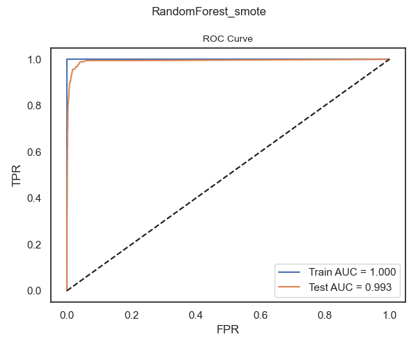
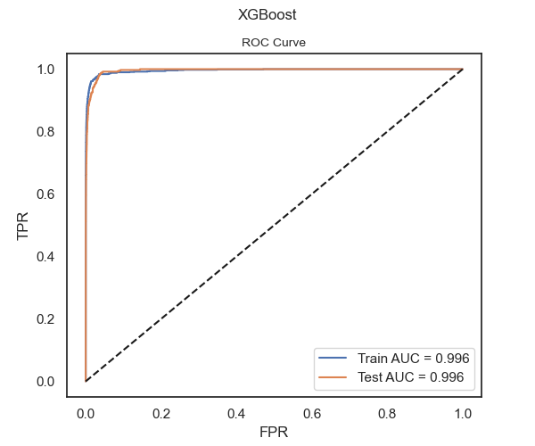
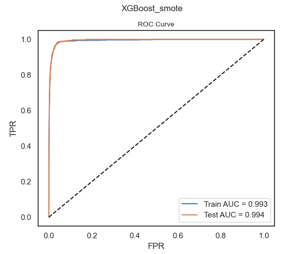

#### 📌 Insight

-   Similar AUC across models
-   AUC alone is insufficient for imbalanced data

------------------------------------------------------------------------

## 🔍 Key Insights

-   Class imbalance significantly affects model performance\
-   Accuracy is not reliable for imbalanced datasets\
-   SMOTE improves Recall but reduces Precision\
-   Trade-off between false positives and false negatives is important

------------------------------------------------------------------------

## 📌 Summary

  Aspect             Observation
  ------------------ ----------------------------
  Imbalance Impact   Significant
  Strength           Recall improvement (SMOTE)
  Weakness           Increased false positives
  Evaluation         Must include Recall & AUC

------------------------------------------------------------------------

## 🚀 How to Run

``` bash
pip install numpy pandas scikit-learn imbalanced-learn matplotlib xgboost
jupyter notebook Hsu_WenYen_HW6.ipynb
```

------------------------------------------------------------------------

## 🧩 Notes

-   Tree-based models are robust to:
    -   Outliers
    -   Correlated features
-   SMOTE may introduce noise
-   Model choice depends on application needs

------------------------------------------------------------------------

## 📂 Project Structure

├── Hsu_WenYen_HW6.ipynb
├── README.md
├── images/
│   ├── correlation_matrix.png
│   ├── feature_distribution.png
│   ├── RandomForest_ROC_Curve.png
│   ├── RandomForest_Train_Confusion_Matrix.png
│   ├── RandomForest_Test_Confusion_Matrix.png
│   ├── RandomForest_balanced_ROC_Curve.png
│   ├── RandomForest_balanced_Train_Confusion_Matrix.png
│   ├── RandomForest_balanced_Test_Confusion_Matrix.png
│   ├── XGBoost_ROC_Curve.png
│   ├── XGBoost_Train_Confusion_Matrix.png
│   ├── XGBoost_Test_Confusion_Matrix.png
│   ├── XGBoost_smote_ROC_Curve.png
│   ├── XGBoost_smote_Train_Confusion_Matrix.png
│   └── XGBoost_smote_Test_Confusion_Matrix.png
------------------------------------------------------------------------

## 👨‍💻 Author

Wen-Yen (Hank) Hsu

------------------------------------------------------------------------

## ⭐ Project Summary

A study on handling imbalanced classification using tree-based models
and SMOTE on the APS Failure dataset.
