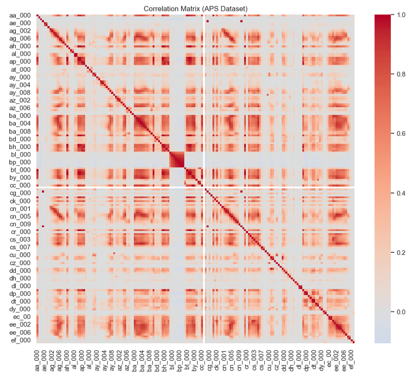

# 📊 APS Failure Prediction with Tree-Based Models

## 📌 Overview

This project focuses on solving a **binary classification problem on an
imbalanced dataset**, using the APS Failure dataset.

The study explores: - Tree-based machine learning models\
- The impact of **class imbalance**\
- Techniques for improving minority class detection

This project emphasizes **practical implementation and performance
analysis**, rather than theoretical derivation.

------------------------------------------------------------------------

## 📖 Problem Description

The goal is to predict whether a system will fail based on sensor
measurements.

### 🔹 Key Challenges

-   Highly **imbalanced dataset**\
-   Large number of missing values\
-   Difficulty detecting rare failure events

------------------------------------------------------------------------

## 🧠 Methodology

### 🔹 Data Preprocessing

-   Missing value imputation (Median)\
-   Missing indicator variables\
-   Feature variability analysis (Coefficient of Variation)\
-   Correlation analysis\
-   Data visualization

#### 📌 Purpose

-   Improve data quality\
-   Understand feature behavior

------------------------------------------------------------------------

### 🔹 Model 1: Random Forest (Baseline)

-   Trained on original dataset\
-   Ensemble of decision trees

#### 📊 Evaluation

-   Training error\
-   Test error\
-   OOB (Out-of-Bag) error

#### ⚠️ Limitation

-   Biased toward majority class

------------------------------------------------------------------------

### 🔹 Class Imbalance Handling

#### ⚠️ Problem

-   Failure cases are rare\
-   Model tends to ignore minority class

#### ✅ Solution

-   **SMOTE (Synthetic Minority Over-sampling Technique)**

#### 📈 Effect

-   Balances class distribution\
-   Generates synthetic minority samples

------------------------------------------------------------------------

### 🔹 Model 2: Random Forest + SMOTE

-   Trained on rebalanced dataset

#### 📊 Observations

-   Recall increases\
-   More failures detected\
-   False positives increase\
-   AUC remains similar

------------------------------------------------------------------------

### 🔹 Model 3: XGBoost

-   Gradient boosting model

#### 📊 Characteristics

-   Strong predictive performance\
-   Sensitive to hyperparameters

------------------------------------------------------------------------

## ⚙️ Features

### 🔹 Model Capability

-   Handles **imbalanced classification problems**

### 🔹 Models Used

-   Random Forest\
-   XGBoost

### 🔹 Evaluation Metrics

-   Accuracy\
-   Precision\
-   Recall\
-   F1-score\
-   AUC

------------------------------------------------------------------------

## 📂 Dataset

### 🔹 APS Failure Dataset

-   Industrial sensor data

#### 📊 Label Definition

-   `0` → Normal\
-   `1` → Failure

#### 📌 Characteristics

-   Highly imbalanced\
-   Contains many missing values

------------------------------------------------------------------------

## 📈 Results

### 🔹 Random Forest (Baseline)

-   High accuracy\
-   Poor minority class detection

------------------------------------------------------------------------

### 🔹 Random Forest + SMOTE

-   Significant improvement in Recall\
-   Better detection of failure cases\
-   Increase in false positives\
-   AUC remains similar

------------------------------------------------------------------------

### 🔹 Model Comparison

  Model           Accuracy   Precision   Recall   AUC
  --------------- ---------- ----------- -------- -----
  Random Forest   XX         XX          XX       XX
  RF + SMOTE      XX         XX          XX       XX
  XGBoost         XX         XX          XX       XX

------------------------------------------------------------------------

## 📊 Visualization

### 🔹 Correlation Matrix



#### 📌 Insight

-   Some features are highly correlated\
-   Tree models are less affected by multicollinearity

------------------------------------------------------------------------

### 🔹 Class Distribution


#### 📌 Insight

-   Severe class imbalance\
-   Resampling is necessary

------------------------------------------------------------------------

### 🔹 Confusion Matrix (Before SMOTE)


------------------------------------------------------------------------

### 🔹 Confusion Matrix (After SMOTE)


#### 📌 Insight

-   Improved detection of failure cases

------------------------------------------------------------------------

### 🔹 ROC Curve Comparison


#### 📌 Insight

-   Similar AUC across models\
-   AUC alone is insufficient for imbalanced data

------------------------------------------------------------------------

## 🔍 Key Insights

-   Class imbalance significantly affects model performance\
-   Accuracy is not reliable for imbalanced datasets\
-   SMOTE improves Recall but reduces Precision\
-   Trade-off between false positives and false negatives is important

------------------------------------------------------------------------

## 📌 Summary

  Aspect             Observation
  ------------------ ----------------------------
  Imbalance Impact   Significant
  Strength           Recall improvement (SMOTE)
  Weakness           Increased false positives
  Evaluation         Must include Recall & AUC

------------------------------------------------------------------------

## 🚀 How to Run

``` bash
pip install numpy pandas scikit-learn imbalanced-learn matplotlib xgboost
jupyter notebook Hsu_WenYen_HW6.ipynb
```

------------------------------------------------------------------------

## 🧩 Notes

-   Tree-based models are robust to:
    -   Outliers\
    -   Correlated features\
-   SMOTE may introduce noise\
-   Model choice depends on application needs

------------------------------------------------------------------------

## 📂 Project Structure

    ├── Hsu_WenYen_HW6.ipynb
    ├── README.md
    ├── images/
    │   ├── pipeline.png
    │   ├── correlation_matrix.png
    │   ├── class_distribution.png
    │   ├── rf_confusion_matrix.png
    │   ├── smote_confusion_matrix.png
    │   └── roc_comparison.png

------------------------------------------------------------------------

## 👨‍💻 Author

Wen-Yen (Hank) Hsu

------------------------------------------------------------------------

## ⭐ Project Summary

A study on handling imbalanced classification using tree-based models
and SMOTE on the APS Failure dataset.
